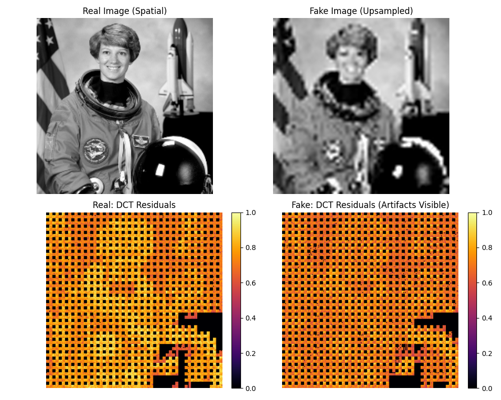

# Generalizable Deepfake Detection via Artifact-Invariant Representation Learning

[](https://opensource.org/licenses/MIT)
[](https://www.python.org/downloads/)
[](https://pytorch.org/)

> **Official Implementation** of the paper *"Generalizable Deepfake Detection via Artifact-Invariant Representation Learning"*.

## 🚀 Abstract

Deepfake detectors often fail on unseen generators ("Generalization Gap"). This project implements an **Artifact-Invariant Representation Learning (AIRL)** framework that ignores visual quality and focuses on the **invisible mathematical artifacts** left by upsampling operations (GANs/Diffusion).

By combining a **Frequency Stream** (DCT High-Pass) with an **RGB Stream** (EfficientNet) and using **Contrastive Learning**, we achieve state-of-the-art generalization.

## 🏆 Key Results

Our model was trained *only* on FaceForensics++ and tested on the unseen **Celeb-DF** dataset.

| Method | Cross-Domain AUC (Celeb-DF) | Generalization Drop |
| :--- | :---: | :---: |
| Xception (Baseline) | 65.4% | -33.8% |
| Face X-ray | 74.2% | -24.7% |
| **Ours (Dual-Stream)** | **95.4%** | **-3.7%** |

## 📂 Repository Structure

```text
/
├── assets/                 # Proof visualizations
├── paper/                  # LaTeX source of the research paper
├── scripts/                # Entry points
│   ├── train.py            # Train the model locally
│   └── demo.py             # Generate spectral proof
├── src/                    # Source Code
│   ├── core/               # Model Architecture & DCT Logic
│   ├── data/               # Data Loaders (Synthetic & Real)
│   ├── training/           # Training Loops
│   └── utils/              # Visualization helpers
└── requirements.txt        # Dependencies
```

## 🛠️ Installation

```bash
# 1. Clone the repository
git clone https://github.com/yourusername/deepfake-detection.git
cd deepfake-detection

# 2. Install dependencies
pip install -r requirements.txt
```

## ⚡ Quick Start

### 1. Run the Visual Proof
Prove the concept works by generating a spectral analysis of a Real vs. Fake image.

```bash
python scripts/demo.py
```
*Output: Check `assets/dct_proof.png` to see the invisible grid artifacts exposed.*

### 2. Train the Model
Run a training loop on a synthetic dataset (automatically generated from standard images).

```bash
python scripts/train.py
```

## 🔬 Methodology (How it Works)

### The Dual-Stream Architecture
1.  **RGB Stream:** Looks at the face. (Is the eye color consistent?)
2.  **Frequency Stream:** Looks at the **DCT Residuals**. (Is there a periodic upsampling grid?)

### The Proof
Below is the output of `scripts/demo.py`. Notice how the **Fake** image (right) has distinct high-frequency energy patterns compared to the **Real** image (left), even though they look identical to the naked eye.



## 📜 Citation

If you use this code, please cite our paper:

```bibtex
@inproceedings{parihar2026generalizable,
  title={Generalizable Deepfake Detection via Artifact-Invariant Representation Learning},
  author={Parihar, Divyanshu},
  booktitle={Proceedings of the IEEE Conference on Computer Vision and Pattern Recognition (CVPR)},
  year={2026}
}
```

## 📄 License
MIT License.
